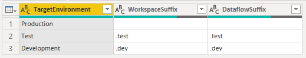
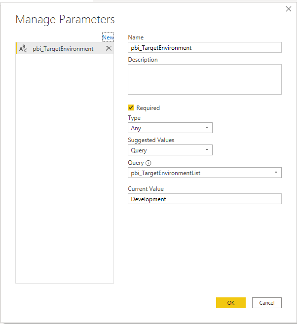

When you first start creating dataflows, it is easy to create a dataflow and put it into production; however, there will be times when you will want to make updates, changes and other fixes to a dataflow. This framework defines three environments: 
<!--more-->
1. Production 
2. Test 
3. Development

The linch pin to this framework is leveraging _parameters_ within Power BI and referencing a dataflow by its _name_ instead of its _id_.

The following figure is a json based table that defines the three environments.



For the case that you have a workspace called `dataflow.workspace` and a dataflow called `dataflow.example` the following setup in Power BI is expected.

* Production.
  * Workspace: `dataflow.workspace`
  * Dataflow: `dataflow.example`
* Test.
  * Workspace: `data.workspace.test`
  * Dataflow: `dataflow.example.test`
* Development.
  * Workspace: `data.workspace.dev`
  * Dataflow: `dataflow.example.dev`


To create this parameter will define a table (`pbi_TargetEnvironmentLUV`) that shall hold our environment information and then derive a list (`pbi_TargetEnvironmentList`) from that table that will act as drop dropdown list for our parameter (`pbi_TargetEnvironment`). 

The following power query code will generate `pbi_TargetEnvironmentLUV`.

```fsharp

let
    Source = Table.FromRows(Json.Document(Binary.Decompress(Binary.FromText("i45WCijKTylNLsnMz1PSUQKhWJ1opZDU4hIgW68EmQZJuKSWpebkF+Sm5oHFU1LLYFRsLAA=", BinaryEncoding.Base64), Compression.Deflate)), let _t = ((type nullable text) meta [Serialized.Text = true]) in type table [TargetEnvironment = _t, WorkspaceSuffix = _t, DataflowSuffix = _t]),
    #"Trimmed Text" = Table.TransformColumns(Source,{{"TargetEnvironment", Text.Trim, type text}, {"WorkspaceSuffix", Text.Trim, type text}, {"DataflowSuffix", Text.Trim, type text}})
in
    #"Trimmed Text"

```

The following power query code will generate `pbi_TargetEnvironmentList`. 

```fsharp
let
    Source = pbi_TargetEnvironmentLUV,
    TargetEnvironment = Table.SelectColumns(Source,{"TargetEnvironment"}),
    TargetEnvironmentList = Table.ToList(TargetEnvironment)
in
    TargetEnvironmentList
```

Now we can add our `pbi_TargetEnvironment` parameter. 

```fsharp
"Development" meta [IsParameterQuery=true, ExpressionIdentifier=pbi_TargetEnvironmentList, Type="Any", IsParameterQueryRequired=true]
```



The following power query function (`pbi_GetDataflow`) needs to be used to access dataflows. You pass the workspace (`ws`), the dataflow (`df`), and the entity (`e`) you want to load. The function will use the value selected y the `pbi_TargetEnvironment`. 

> NOTE: You may need to _Refesh Preview_ if the dataflow is new.

```fsharp
let  
    GetDataflow = (ws as text, df as text, e as text) as table =>
    let
        Source = PowerBI.Dataflows(null),
        wsEnv = ws & pbi_TargetEnvironmentLUV{[TargetEnvironment=pbi_TargetEnvironment]}[WorkspaceSuffix],
        dfEnv = df & pbi_TargetEnvironmentLUV{[TargetEnvironment=pbi_TargetEnvironment]}[DataflowSuffix],
        Workspace = Source{[workspaceName=wsEnv]}[Data],
        Dataflow = Workspace{[dataflowName=dfEnv]}[Data],
        Entity = Dataflow{[entity=e]}[Data]
    in  
        Entity
 
in  
    GetDataflow
```

We should now have the following defined as part of our dataset (make sure that _Enable load_ is unchecked for all them)

* `pbi_TargetEnvironmentLUV`. Environment Lookup Value _table_.
* `pbi_TargetEnvironmentList`. Enivronment _list_.
* `pbi_TargetEnvironment`. Environment _parameter_. 
* `pbi_GetDataflow`. Dataflow _function_. 

Putting this all together we can load a dataflow in the following manner. 

```fsharp
let
    Source = pbi_GetDataflow("dataflow.workspace", "dataflow.name", "dataflow.entity")
in
    Source
```

I also recommend using a recommend using an intermediate query to hold the results and then reference those results with a query that is marked to _Enable Load_.

For example, I will create a query called `Dataflow_Entity_Src` and then reference like this.

```fsharp
let
    Source = Dataflow_Entity_Src
in
    #"Removed Duplicates"
```

This avoids side-effects of switching dataflows on the fly such as all columns you may have hidden are no longer hidden.


